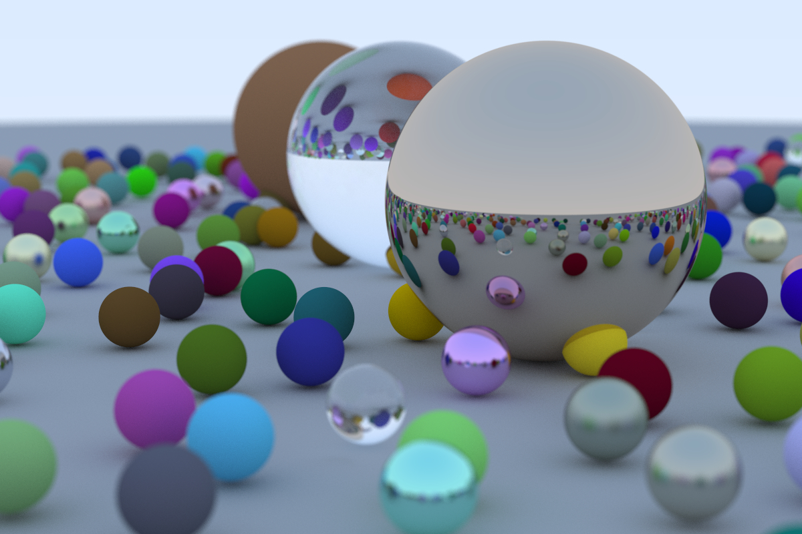

# Ray Tracing in Rust

## 光线追踪原理

光线追踪是一种 3D 模型场景的图像渲染技术，通过模拟光线的传播过程（包含在物体表面的反射、散射、折射），计算出光线在图像像素点上呈现的像素色彩。


如上面的示意图，光线从光源出发，经过物体的反射进入相机，最终在像素点上形成对应的图像。但由于从光源发射的光线只有小部分被相机所收集，所以为了节省计算量，在光纤追踪计算过程中，我们利用光纤传播的可逆性 (backward tracing)，让每条追踪光线由相机射出，经过像素点，经过物体表面的若干次反射折射，抵达光源，最终计算出光线的颜色，作为像素点颜色。

光线的直线传播过程可以用函数 $\mathbf P(t) = \mathbf A + t\mathbf b$ 来表示，其中 $\mathbf P(t)$ 表示光子在 $t$ 时刻在空间中的坐标，$\mathbf A$ 表示光线的起点坐标，$\mathbf b$ 表示直线传播的方向向量。

三维空间中的一个球体可以表示为 $(\mathbf P - \mathbf C)\cdot (\mathbf P - \mathbf C) = R^2$，其中 $\mathbf P$ 表示球面上的点坐标，$\mathbf C$ 表示球心的坐标，$R$ 表示球的半径。

计算一条光线与一个球体是否相交以及相交点，可以通过求解方程 $(\mathbf P(t) - \mathbf C)\cdot (\mathbf P(t) - \mathbf C) = R^2$ 来得到。通过代入 $\mathbf P(t) = \mathbf A + t\mathbf b$$\mathbf P(t)$ 可以得到 $t^2\mathbf b\cdot\mathbf b + 2t\mathbf b\cdot(\mathbf A - \mathbf C) + (\mathbf A - \mathbf C)\cdot(\mathbf A - \mathbf C) - R^2=0$，即一个关于标量 $t$ 的一元二次方程。

当光线与物体表面相交时，常见地有漫反射 (diffuse reflection)、镜面反射 (specular reflection)、折射 (refraction) 等行为，分别对应于纤维材质表面、金属材质表面、玻璃材质表面。

> Diffuse reflection is the reflection of light from a surface such that an incident ray is reflected at many angles, rather than at just one angle as in the case of specular reflection.

漫反射的一种理想形式是 Lambertian reflection, 其散射强度在空间中的分布为 $I = I_0\cos(\theta)$，其中 $I_0$ 为入射强度，$\theta$ 为散射角。由于散射光线服从一定的概率分布，而非特定方向，这在模拟计算过程中可以通过蒙特卡洛采样来进行计算。

对于镜面反射，其反射角是确定的，可以通过等式 $\mathbf d_r = \mathbf d_i - 2(\mathbf d_n \cdot \mathbf d_i)\mathbf d_n$ 进行计算，其中 $\mathbf d_n$ 为相交点的法向向量，$\mathbf d_i$ 为入射光线的方向向量。

对于折射现象，入射光线会分成折射和反射两束，也可以使用蒙特卡洛采样进行模拟。折射(透射)光线的角度服从 Snell 定律，$n_i \sin \theta_i = n_t \sin \theta_t$，其中 $n_i$, $n_t$ 分别为入射介质和透射介质的折射率，$\theta_i$, $\theta_t$ 分别为入射角和透射角。

光线每次在物体表面进行反射折射时，都会出现一定的衰减，衰减的行为由物体材料性质决定，比如红色不透明物体在反射光线时，对红色光的衰减系数要比绿光和蓝光的衰减系数要小。如果使用三原色来表示光线颜色，那么就可以使用一个三元数组来表示物体表面的衰减特性。

## 代码实现

下图是光线追踪的实现效果。具体的算法实现细节内容比较多，且相对直观，这里就不一一说明。具体的实现代码已上传 [CodeHub 仓库](https://codehub-y.huawei.com/c00523676/ray-tracing/files?ref=master)。更详细的实现步骤说明可以参考 reference-1。



## 性能优化

上面的光线追踪算法实现中涉及了大量的向量运算，同时每条光线传播过程的模拟可以并行计算。下面我们介绍 Rust 中的 SIMD 和 Rayon 并行化来提升算法的性能。

SIMD，单指令多数据，是一种 (大多数) CPU硬件层面支持的指令级并行化处理。SIMD 并行允许一条指令同时对多条数据进行并行操作。Rust-nightly 提供了 portable_simd APIs, 相对容易使用，而不用过多关注底层运行的硬件架构。

> SIMD is an instruction set available mostly on all current processors. SIMD instructions give data-level parallelism on a unit (vector of data). A single instruction is executed in parallel on multiple data points as opposed to executing multiple instructions. This improves the performance of application.

下面的示意代码展示了使用 SIMD 计算一个宽度为 4 的向量长度的函数：

```rust
#![feature(portable_simd)]
use std::simd::f32x4;

fn main() {
    let arr: [f32; 4] = rand::random();
    // let len_simd = vec_length(arr);
    let len_simd = vec_length_simd(arr);
    println!("vec length: {}", len_simd);
}

fn vec_length_simd(vec: [f32; 4]) -> f32 {
    (f32x4::from_slice(&vec) * f32x4::from_slice(&vec))
        .reduce_sum()
        .sqrt()
}

fn vec_length(vec: [f32; 4]) -> f32 {
    vec.iter().map(|&x| x * x).sum::<f32>().sqrt()
}
```

我们对两个函数进行了性能测试，发现有没有使用 SIMD 没有明显差别。这应该是 Rust 编译器自动进行了一些优化。在光线追踪程序上，也验证了类似的结果，这是优化之前没有预期到的。

Rayon 是一个简洁易用的 Rust 多线程第三方库，可以方便地实现对数据迭代器的并发迭代。下面是每一行像素点模拟的并发执行的实现，对原有单线程代码的改动非常小。

```rust
let mut pixel_rows: Vec<_> = (0..IMAGE_HEIGHT)
    .into_par_iter()
    .map(|j| {
        let mut pixel_row = [Color::default(); IMAGE_WIDTH];
        let mut rng = rand::thread_rng();
        for i in 0..IMAGE_WIDTH {
            let mut pixel_color = Color::default();
            for _ in 0..SAMPLES_PER_PIXEL {
                let u = (i as f32 + rng.gen::<f32>()) / (IMAGE_WIDTH - 1) as f32;
                let v = (j as f32 + rng.gen::<f32>()) / (IMAGE_HEIGHT - 1) as f32;
                let r = cam.get_ray(u, v);
                pixel_color += ray_color(&r, &world, MAX_DEPTH);
            }
            pixel_row[i] = pixel_color;
        }
        (j, pixel_row)
    })
    .collect();
```

下面是多线程和单线程的性能测试结果对比，性能整体提升到了 180%。但 `usr time` 提升了超过一倍，说明线程调度的开销也是挺大的。

```shell
# simple thread without performance optimization
real-time: 71.55 secs usr-time: 70.91 secs sys-time: 0.94 secs

# multi-thread with performance optimization
real-time: 39.15 secs usr-time: 152.90 secs sys-time: 0.27 secs
```

## References:

- [ray-tracing in one weekend](https://misterdanb.github.io/raytracinginrust/)
- [ray-tracing wiki](https://en.wikipedia.org/wiki/Ray_tracing_(graphics))
- [ray-tracing in a Nutshell](https://www.scratchapixel.com/lessons/3d-basic-rendering/introduction-to-ray-tracing/raytracing-algorithm-in-a-nutshell)
- [diffuse reflection](https://en.wikipedia.org/wiki/Diffuse_reflection)
- [Lambert's cosine law](https://en.wikipedia.org/wiki/Lambert%27s_cosine_law)
- [Single instruction, multiple data](https://en.wikipedia.org/wiki/Single_instruction,_multiple_data)
- [Beginner's Guide To SIMD](https://github.com/rust-lang/portable-simd/blob/master/beginners-guide.md)
- [Crate core_simd](https://rust-lang.github.io/portable-simd/core_simd/)
- [Crate rayon](https://docs.rs/rayon/latest/rayon/)
